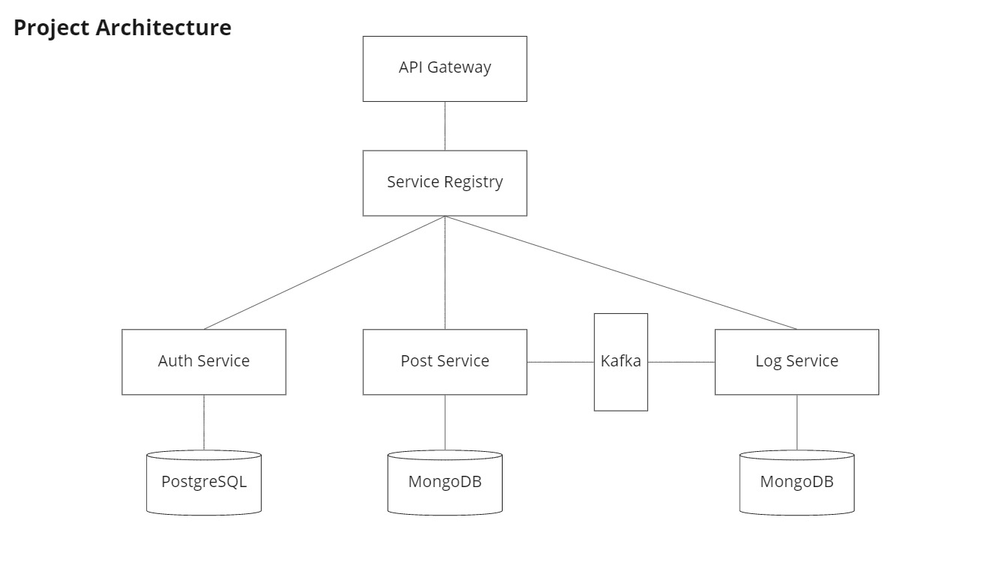
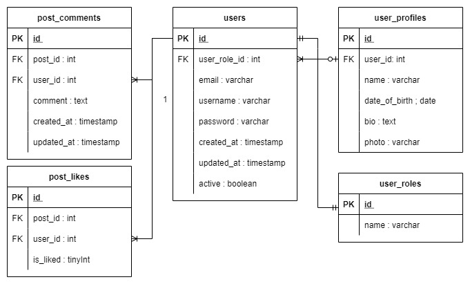
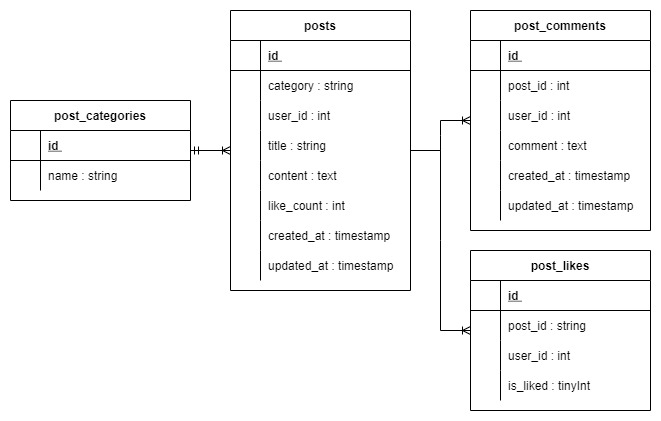

# Final Project BNI Bootcamp :   Banking Crowd Academy Platform

## Epic: Crowd Academy Membership Enrollment

- Anyone, both SMEs/practitioners and learners can join as a trainer or learner to the academy platform using email or social account
- Crowd academy platform admin can see the detail of enrollment member
- As a trainer or learner, they can choose which training topic/categories they want
- As a trainer or learner, they can give/update their basic profile information

## Epic: Bank Crowd Academy Collaboration

- As a trainer or learner, they can see the detail of selected post
- As a trainer or learner, they can give comment, like and share the selected post
- As a trainer, they can post new article related to insight/handons tutorial on particular categories
- As a learner, they can see the detail of published training on the academy platform 
- As a learner, they can give comment, like and share for their training

## High Level Architecture

## Entity Relation Diagram

## NoSql Data Model

